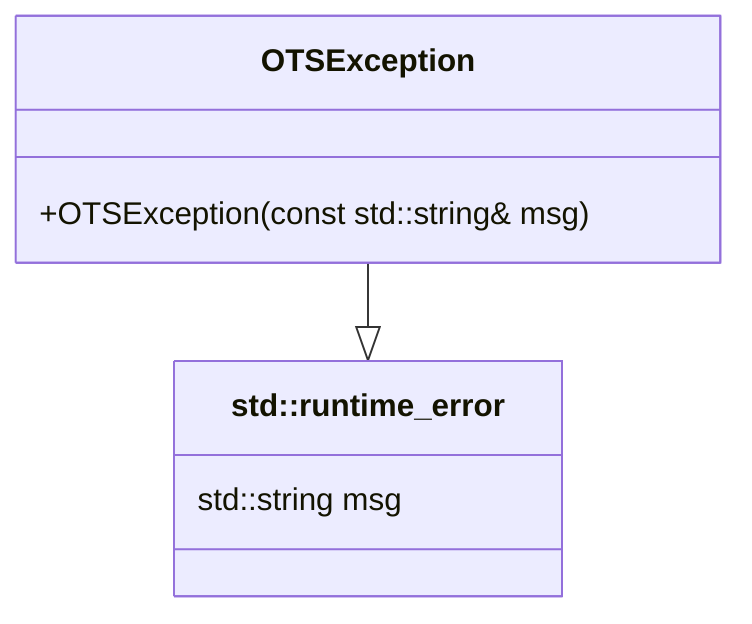
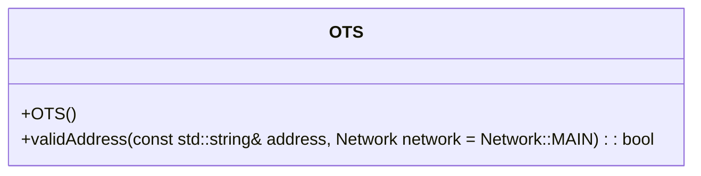
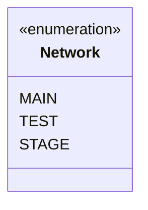
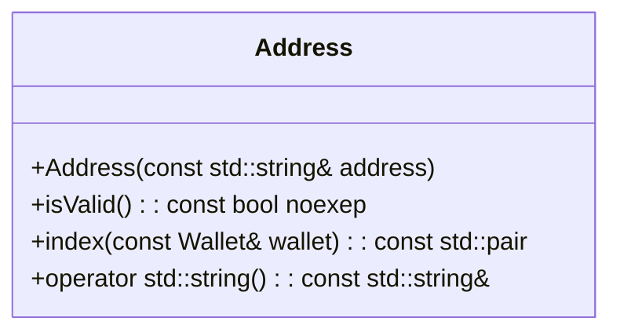
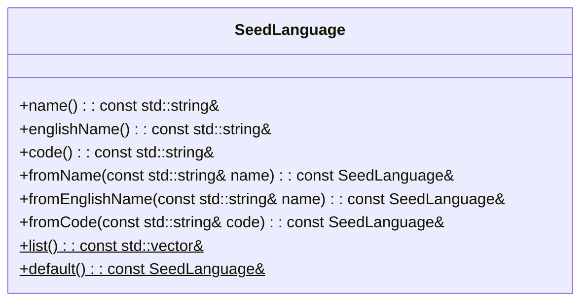
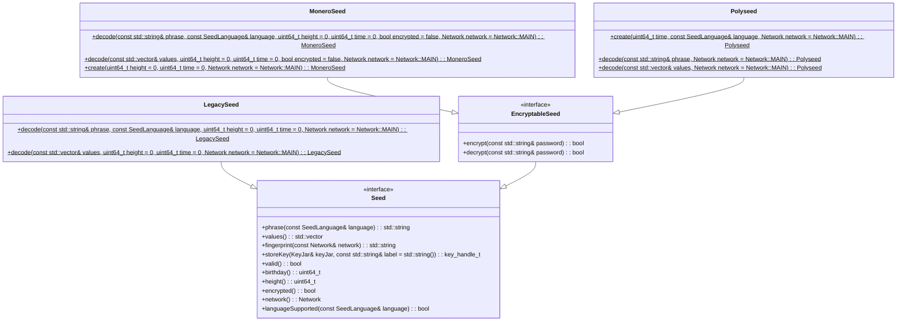
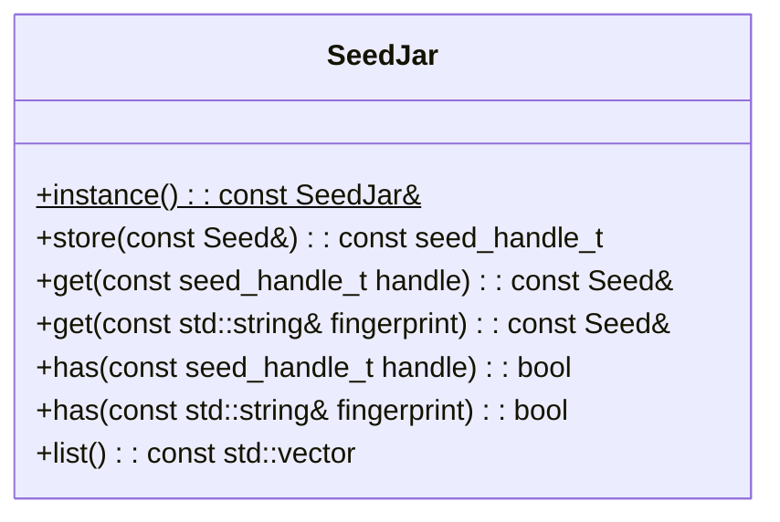
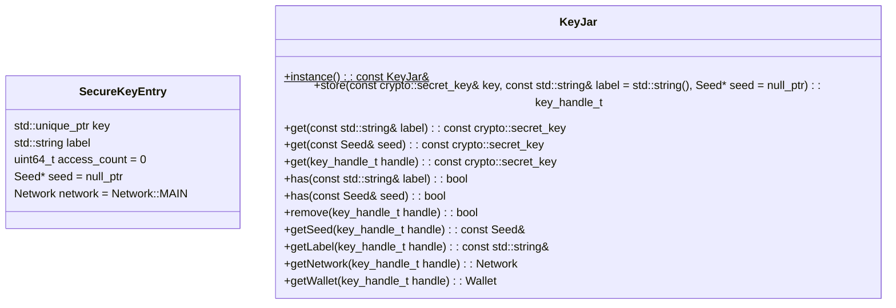
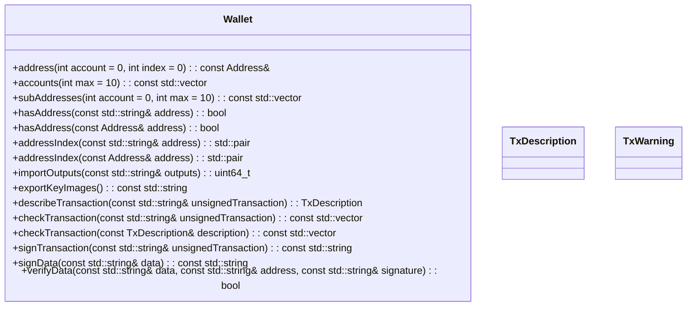

!!! warning
    This was the initial design of the third iteration, which is not in sync with the actual development at the moment, as it will be synced when there are (probably) no more changes.
    Even the [reference](./reference/index.html) will be at the most probably, behind how it is not yet automatically synced - which should happen at a later point in time.

